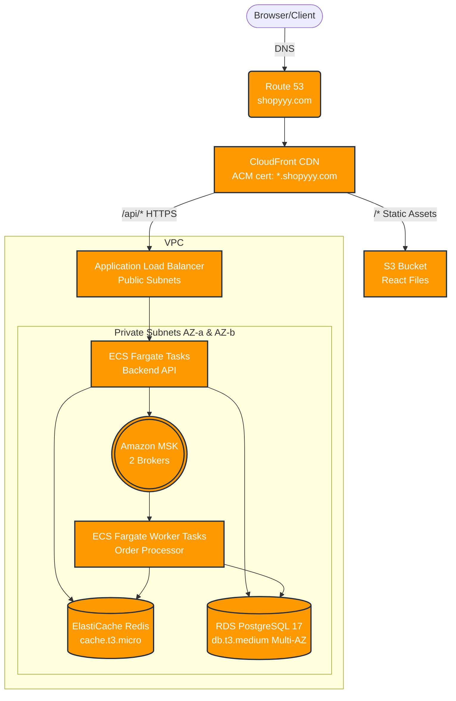

# Shopyyy — AWS Infrastructure


This repository contains the Terraform code that provisions the full AWS infrastructure for the **Shopyyy** e-commerce platform.

---

## Architecture Overview



### Components

| Component | AWS Service | Notes |
|-----------|-------------|-------|
| DNS | Route 53 | shopyyy.com hosted zone |
| SSL/TLS | ACM | shopyyy.com + *.shopyyy.com; us-east-1 cert for CloudFront |
| CDN | CloudFront | Serves frontend from S3; proxies /api/* to ALB |
| Frontend | S3 | Static React files; OAC — no public access |
| Load Balancer | ALB | Public subnets; HTTPS 443; forwards to ECS |
| Backend API | ECS Fargate | 2 tasks across 2 AZs; private subnets |
| Cache | ElastiCache Redis | Single node; private subnets |
| Queue | Amazon MSK | 2 Kafka brokers across 2 AZs; private subnets |
| Database | RDS PostgreSQL 17 | Multi-AZ; private subnets; encrypted |
| Secrets | Secrets Manager | DB credentials & Redis auth token |
| Networking | VPC | 2 public + 2 private subnets; NAT GW per AZ |

### Security Group Rules

| SG | Inbound | From |
|----|---------|------|
| ALB | 443 | CloudFront managed prefix list |
| ECS | all TCP | ALB SG |
| RDS | 5432 | ECS SG |
| ElastiCache | 6379 | ECS SG |
| MSK | 9092, 9094 | ECS SG |

---

## Repository Structure

```
terraform/
├── backend.tf               # S3 remote state & provider config
├── main.tf                  # Root module — wires all child modules
├── variables.tf             # All configurable values
├── outputs.tf               # Key outputs (CloudFront URL, ALB DNS, etc.)
├── terraform.tfvars.example # Example variable values
└── modules/
    ├── networking/          # VPC, subnets, IGW, NAT GW, route tables
    ├── security_groups/     # ALB, ECS, RDS, ElastiCache, MSK SGs
    ├── dns_ssl/             # Route 53 zone, ACM certs, DNS validation
    ├── s3/                  # Frontend bucket, encryption, versioning, OAC
    ├── cloudfront/          # CDN distribution, origins, cache behaviours
    ├── load_balancer/       # ALB, target group, HTTPS & HTTP listeners
    ├── compute/             # ECS cluster, task definition, Fargate service
    ├── database/            # RDS PostgreSQL, Secrets Manager, parameter group
    ├── caching/             # ElastiCache Redis replication group
    └── kafka/               # Amazon MSK cluster & configuration
```

---

## Prerequisites

- [Terraform](https://developer.hashicorp.com/terraform/install) >= 1.5.0
- AWS CLI configured with credentials that have permission to create all the above resources
- An S3 bucket + DynamoDB table for Terraform remote state (see below)

### Create the remote-state bucket (one-time)

```bash
REGION=us-east-1
PROJECT=shopyyy

aws s3api create-bucket \
  --bucket ${PROJECT}-terraform-state \
  --region ${REGION}

aws s3api put-bucket-versioning \
  --bucket ${PROJECT}-terraform-state \
  --versioning-configuration Status=Enabled

aws s3api put-bucket-encryption \
  --bucket ${PROJECT}-terraform-state \
  --server-side-encryption-configuration \
    '{"Rules":[{"ApplyServerSideEncryptionByDefault":{"SSEAlgorithm":"AES256"}}]}'

aws dynamodb create-table \
  --table-name ${PROJECT}-terraform-state-lock \
  --attribute-definitions AttributeName=LockID,AttributeType=S \
  --key-schema AttributeName=LockID,KeyType=HASH \
  --billing-mode PAY_PER_REQUEST \
  --region ${REGION}
```

---

## Deployment

```bash
cd terraform

# 1. Copy and edit the example variables file
cp terraform.tfvars.example terraform.tfvars
# Edit terraform.tfvars with your values

# 2. Initialise Terraform (downloads providers, configures backend)
terraform init

# 3. Preview the changes
terraform plan -out=shopyyy.tfplan

# 4. Apply
terraform apply shopyyy.tfplan
```

After a successful apply, Terraform will print:

| Output | Description |
|--------|-------------|
| `cloudfront_domain_name` | CloudFront distribution domain |
| `alb_dns_name` | ALB DNS name |
| `rds_endpoint` | RDS host:port (sensitive) |
| `redis_endpoint` | ElastiCache primary endpoint (sensitive) |
| `msk_bootstrap_brokers` | Kafka bootstrap brokers (sensitive) |
| `route53_name_servers` | NS records — point your domain registrar here |

> **Note**: After the first `apply`, update your domain registrar's nameservers to the values
> in `route53_name_servers` so that DNS validation for the ACM certificate completes and
> Route 53 takes over DNS for shopyyy.com.

---

## Clean Up

To avoid incurring future AWS charges, remember to destroy the infrastructure when you are finished testing:

```bash
cd terraform
terraform destroy
```

> **Warning**: This action will permanently delete all provisioned resources, including the RDS database and S3 buckets. Ensure you have backed up any necessary data before proceeding.

---

## Design Decisions

### Why ECS Fargate instead of EC2 or EKS?

- **No server management** — no need to patch, right-size, or manage EC2 instances.
- **Per-task billing** — cost scales directly with actual workload; no idle capacity.
- **Simpler than EKS** — EKS is powerful but overkill for a straightforward API-behind-ALB
  pattern; it adds significant operational complexity (control plane, node groups, RBAC).
- **Built-in AZ spreading** — providing two private subnets (one per AZ) automatically
  spreads tasks across availability zones.

### Why Amazon MSK instead of SQS or SNS?

MSK (Kafka) preserves message ordering per partition and allows multiple independent consumer
groups to replay the same stream — useful for order processing pipelines where the order worker,
analytics, and notifications all need to consume the same events independently.

### Cost Considerations

Please be aware that this infrastructure includes resources that do not fit entirely within the AWS Free Tier and will incur monthly costs if left running:
- **Amazon MSK**: Running 2 brokers incurs a baseline hourly cost.
- **RDS PostgreSQL**: Multi-AZ deployments are billed for both the primary and standby instances.
- **ECS Fargate & ElastiCache**: Billed based on hourly usage, vCPU, and memory capacity.
- **NAT Gateways**: 2 NAT Gateways (one per AZ) incur an hourly charge plus data processing fees.